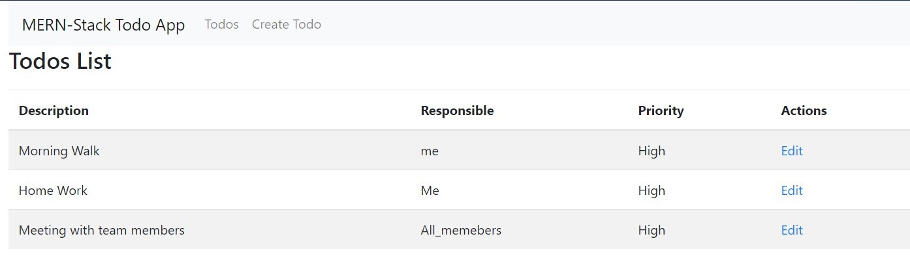
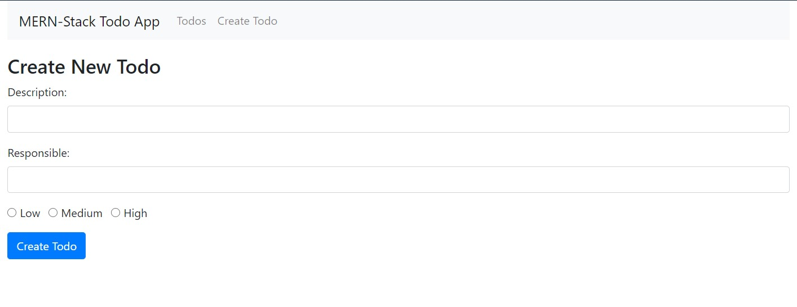

# mytodolist
 Here is my first todoapp deployed on Heroku.Let's see the different pages of mytododlist:

 

 <hr/>
 
 

 ## Installation

```bash
# Install dependencies for server
npm install

# Install dependencies for client
npm run client-install

# Run the client & server with concurrently
npm run dev

# Run the Express server only
npm run start

# Run the React client only
npm run client

# Server runs on http://localhost:5000 and client on http://localhost:3000
```

## More

- If you want to run this project locally, you must change the value of **MONGO_URL** on the server.js file, with your own 
  MongoDB Database.
